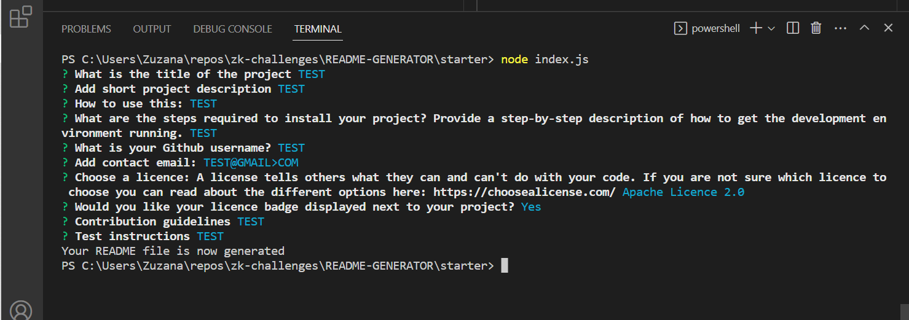

     
# README GENERATOR   

-----   
        
## DESCRIPTION
Using this generator your README file will always look professional. You will be able to add all the important information in, ensuring that your project can be understood and used correctly.

## Table of Contents

 * [Installation](#depencencies)
 * [Usage](#usage)
 * [Contribution guidelines](#contributing)
 * [Test instructions](#tests)
 * [Questions](#questions)
 * [Licence](#licence)

-----

## Installation
  1. To use the application fork the repository to your own account
  2. Download the repo to your local command line application

## Usage
  The generator can be used to generate a skeleton of README file. This can be subsequently filled in directly in the newly created file.
  It can also be fully prepared directly in the command-line terminal following prompts and answering all the questions.
  1. open command-line terminal
  2. ensure that you cd into the generator folder: README-GENERATOR\starter
  3. type "node index.js" and press enter
  4. respond to prompts that are displayed
  5. once you complete responding the README file is generated. The file can be amended or added to as usual. 
  6. Don't forget to move the file to your new-project repository
  7. BEWARE each time you generate the README file - old version stored in this folder will be overwritten
  8. PS this README was generated using this generator 😊

## Contribution guidelines
  You are welcome to contribute to this project. To do so make sure that you get in touch with me and let me know.

## Test instructions
  No tests are required

            
## Questions
If you have any additional questions not answered here or wish to get in touch regarding developments, you can use the following links:
Github link: [github.com/ZuzanaElt](https://https://github.com/ZuzanaElt)
Contact email: zuzanaeltom@gmail.com 

## License
This application is covered under MIT Licence licence. 
To learn more about licences including this one visit https://choosealicense.com/

## Screenshots

